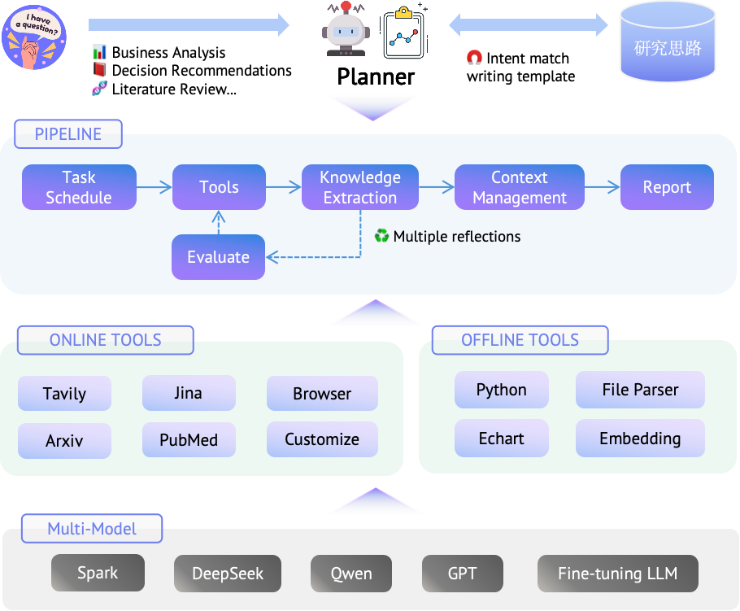
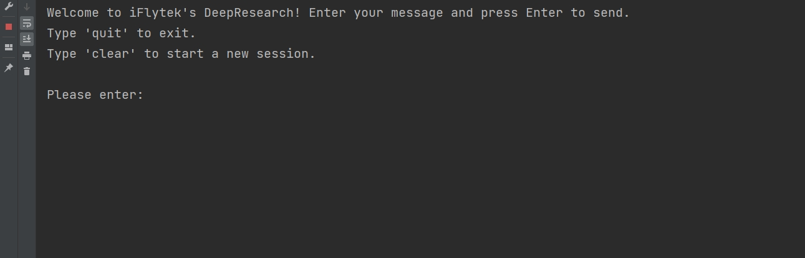

<div align="center">
  

**A lightweight deep research framework based on progressive search and cross-evaluation.**

[](LICENSE)
[](https://github.com/iflytek/DeepResearch/releases)
[](https://github.com/iflytek/DeepResearch/stargazers)

English | [简体中文](docs/README_Zh.md)
</div>

# Introduction

DeepResearch focuses on solving complex information analysis problems and supports local deployment for individual developers. Through modular context assembly (covering knowledge bases, tool descriptions, and interaction history) and progressive search optimization, it builds an intelligent research workflow of "Task Planning → Tool Calling → Evaluation & Iteration". This workflow effectively alleviates the issues of attention dispersion and information loss when large models process long contexts. Meanwhile, it allows users to introduce custom research workflows, ensuring the output content has thematic focus, comprehensive argumentation, and logical hierarchy.

**Features:**
- Delivers high-quality results without requiring model customization.
- Enables collaboration between small and large models to boost research efficiency and control usage costs.
- Reduces large model hallucinations through knowledge extraction and cross-evaluation verification.
- Supports lightweight deployment and flexible configuration.

**Framework:**
<div align="center">
   
</div>

**Samples:**

[Deep Research Products Global and Domestic Landscape Analysis](https://deep-report-file.xf-yun.com/Deep%20Research%20Products%20Global%20and%20Domestic%20Landscape%20Analysis.html)

[Global AI Agent Products Panoramic Analysis: Core Capabilities and Application Scenarios](https://deep-report-file.xf-yun.com/Global%20AI%20Agent%20Products%20Panoramic%20Analysis%20Core%20Capabilities%20and%20Application%20Scenarios.html)

## Quick Start
This section will explain how to configure the local runtime environment for DeepResearch, or you can visit [SparkDesk](https://xinghuo.xfyun.cn/desk) and go to the "Analysis & Research" tab for an online experience.
### 1. Environment Setup
- Recommended Python version: **3.10.0** (using other versions may cause dependency issues).
- Clone the repository.
   ```bash
   git clone git@github.com:iflytek/DeepResearch.git 
   ```
- Ensure you have Poetry installed(Recommended version:2.2.1).
   ```bash
   poetry --version
   # If Poetry is not installed yet, you can try installing it via the following methods
   # Install Poetry on Bash
   curl -sSL https://install.python-poetry.org | python3 -
   # Install Poetry on PowerShell
   (Invoke-WebRequest -Uri https://install.python-poetry.org -UseBasicParsing).Content | python -
   ```
- Set up your runtime environment
   ```bash
   cd DeepResearch
   poetry install
   poetry env activate
   ```

### 2. Environment Configuration
 According to DeepResearch's workflow, you need to fill in LLM configuration parameters for each module (for the `Planner`, it is recommended to use a reasoning LLM, such as `DeepSeekR1`). 
 
Edit `config/llms.toml` and `config/search.toml` files provide your actual API keys and configuration values: 

- **api_base/api_key/model**: OpenAI-compatible API, from [Iflytek MaaS](https://maas.xfyun.cn/modelSquare) or other platforms.

- **jina_api_key** or **tavily_api_key**: Get your key from [Jina](https://jina.ai/) or [Tavily](https://www.tavily.com/) for web page reading.

### 3. Running DeepResearch
Enjoy the moment.
   ```bash
   poetry run python -m src.run
   ```
<div align="center">
   
</div>

## Contributing

We welcome contributions of all kinds! Please see our [Contributing Guide](CONTRIBUTING.md)

## Support

- Community Discussion: [GitHub Discussions](https://github.com/iflytek/DeepResearch/discussions)
- Bug Reports: [Issues](https://github.com/iflytek/DeepResearch/issues)

## License

This project is licensed under the [Apache 2.0 License](LICENSE).

## Star History

[](https://www.star-history.com/#iflytek/DeepResearch&type=date&legend=top-left)
