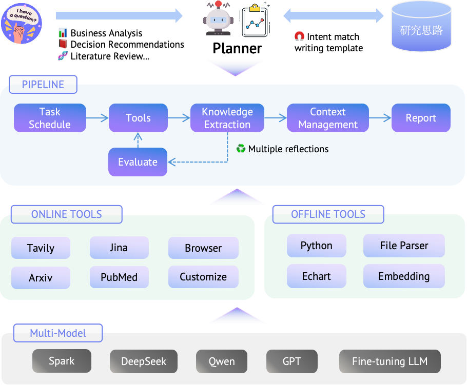
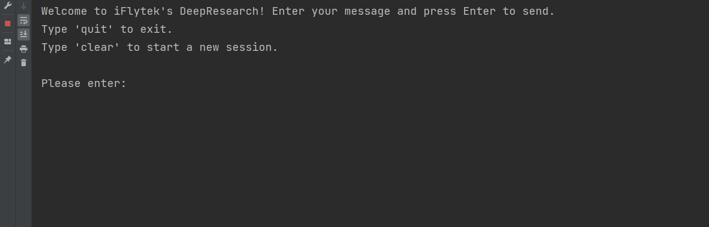

<div align="center">
  

**一个基于渐进式搜索和交叉评估的轻量级深度研究框架。**

[](../LICENSE)
[](https://github.com/iflytek/DeepResearch/releases)
[](https://github.com/iflytek/DeepResearch/stargazers)

[English](../README.md) | 简体中文
</div>

# 项目简介

DeepResearch专注于解决复杂的信息分析问题，并支持个人开发者进行本地部署。通过模块化的上下文组装（涵盖知识库、工具描述和交互历史）和渐进式搜索优化，它构建了一个"任务规划→工具调用→评估与迭代"的智能研究工作流。该工作流有效缓解了大模型处理长上下文时注意力分散和信息丢失的问题。同时，它允许用户引入自定义研究工作流，确保输出内容具有主题聚焦性、论证全面性和逻辑层次感。

**主要特点：**
- 无需模型定制即可提供高质量结果。
- 支持小型和大型模型协同工作，提高研究效率并控制使用成本。
- 通过知识提取和交叉评估验证减少大模型幻觉。
- 支持轻量级部署和灵活配置。

**框架架构：**
<div align="center">
   
</div>

**示例报告：**

[深度研究产品全球与国内格局分析](https://deep-report-file.xf-yun.com/Deep%20Research%20Products%20Global%20and%20Domestic%20Landscape%20Analysis.html)

[全球AI Agent产品全景分析：核心能力与应用场景](https://deep-report-file.xf-yun.com/Global%20AI%20Agent%20Products%20Panoramic%20Analysis%20Core%20Capabilities%20and%20Application%20Scenarios.html)

## 快速开始
本节将介绍如何配置DeepResearch的本地运行环境，或者您也可以访问[讯飞星火](https://xinghuo.xfyun.cn/desk)并进入"分析研究"标签页进行在线体验。
### 1. 环境设置
- 推荐Python版本：**3.10.0**（使用其他版本可能导致依赖问题）。
- 克隆仓库。
   ```bash
   git clone git@github.com:iflytek/DeepResearch.git 
   ```
- 确保已安装Poetry(推荐版本2.1.1)。
   ```bash
   poetry --version
   # 如果尚未安装Poetry，可以尝试通过以下方法安装
   # 在Bash中安装Poetry
   curl -sSL https://install.python-poetry.org | python3 -
   # 在PowerShell中安装Poetry
   (Invoke-WebRequest -Uri https://install.python-poetry.org -UseBasicParsing).Content | python -
   ```
- 设置运行环境
   ```bash
   cd DeepResearch
   poetry install
   poetry env activate
   ```

### 2. 环境配置
 根据DeepResearch的工作流程，您需要为每个模块填写LLM配置参数（对于`Planner`，建议使用推理能力强的LLM，如`DeepSeekR1`）。 
 
编辑`config/llms.toml`和`config/search.toml`文件，提供您的实际API密钥和配置值： 

- **api_base/api_key/model**：兼容OpenAI的API，来自[讯飞云MaaS](https://maas.xfyun.cn/modelSquare)或其他平台。

- **jina_api_key**或**tavily_api_key**：从[Jina](https://jina.ai/)或[Tavily](https://www.tavily.com/)获取密钥用于网页读取。

### 3. 运行DeepResearch
享受这一刻。
   ```bash
   poetry run python -m src.run
   ```
<div align="center">
   
</div>

## 贡献指南

我们欢迎各种形式的贡献！请查看我们的[贡献指南](../CONTRIBUTING.md)

## 支持

- 社区讨论：[GitHub Discussions](https://github.com/iflytek/DeepResearch/discussions)
- 问题反馈：[Issues](https://github.com/iflytek/DeepResearch/issues)

## 许可证

本项目采用[Apache 2.0许可证](../LICENSE)。